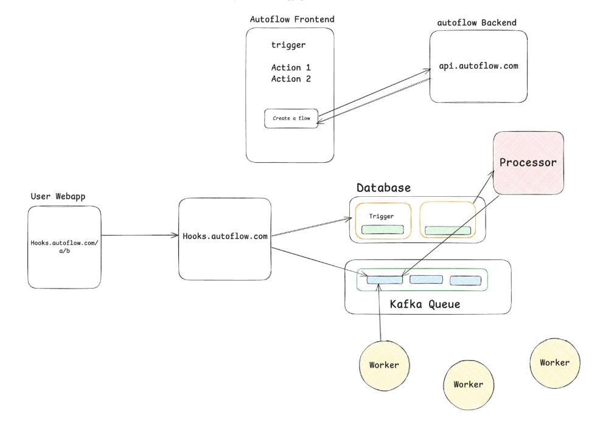

# AutoLink

### **Overview**

This is a scalable and modular workflow designed to handle webhooks, email notifications, Solana blockchain integration and Notion Entry. Built with modern technologies, the platform ensures robust performance, efficient task automation, and seamless integration capabilities.

### **Features**

- **Webhooks**: Trigger events and actions programmatically.
- **Email Notifications**: Automate sending and receiving emails.
- **Solana Integration**: Utilize Solana blockchain for decentralized operations.
- **Notion Entry**: Automate entry to notion database about Solana transaction.
- **Reconcilliation Mechanism**: Deals failure of solana transactions.
- **Scalable Architecture**: Powered by Kafka for message streaming.
- **Full-Stack Solution**: Built using Next.js, Node.js, and Express for both frontend and backend functionalities.
- **Database Management**: Prisma ORM integrated with PostgreSQL for efficient data handling.

### **Some Key Concepts**

- **Webhooks**
- **Asynchronous Backend Communication**
- **Transactional Outbox Pattern**
- **Debezium Architecture**

---

### **Tech Stack**

- **Frontend** : Next.js
- **Backend** : Node.js, Express
- **Database** : PostgresSQL with Prisma
- **Messaging** : Kafka
- **Blockchain** : Solana

---

### **System Design**



---

## **Getting Started**

### Prerequisites

Ensure the following tools are installed on your system:

- Docker (for containerized environment)
- Node.js (v18 or later)
- Kafka (for message brokering)

### Clone Respositry

```
https://github.com/ajay-deshmukh24/AutoLink.git
```

### Set Up Environment Variables

Create a `.env` file in every location where a `.env.example` file is present. Copy the contents of the corresponding `.env.example` file and update the placeholder values with your actual configuration.

### Start the project

1. **Install Dependencies in every folder**:

```
From the root of repo
npm i
```

2. **Start Kafka**:
   If using docker, start kafka with

```
docker run -p 9092:9092 -d apache/kafka:3.9.0
```

Then, access the Kafka container:

```
docker exec -it <container_id> /bin/bash
```

Create a topic named events:

```
bin/kafka-topics.sh --create --topic events --bootstrap-server localhost:9092
```

3. **Run Database Migrations**:
   Go to every folder and migrate the database

```
From the root of repo
npx prisma migrate dev --schema=packages/db/prisma/schema.prisma
npx prisma generate --schema=packages/db/prisma/schema.prisma
```

4. **Run the Application**
   <br/>
   Run the frontend

```
cd apps/frontend
npm run dev
```

Run the primary backend

```
cd apps/primary-backend
npm run start
```

Run the processor

```
cd apps/processor
npm run start
```

Run the worker

```
cd apps/worker
npm run start
```

Run the hooks

```
cd apps/hooks
npm run start
```

5. **Access the application at `http://localhost:3000`**.

## Usage

- **Webhooks**: Configure webhook URLs in github repo and trigger actions on comment.
- **Emails**: Set up email templates and automate notifications.
- **Blockchain**: Utilize Solana integration for blockchain-specific triggers and workflows.
- **Notion Entry**: Entry to notion database about transaction.

## Improvements

- You can observe that processor service is continuously hitting database so, you can integrate with **Debezium Architecture** to listen events on database then only trigger.
- Currently we are using our own solana wallet key to send solana. Learn How Solana Backend will communicate with our application backend to signIn to users solana wallet from our frontend.
